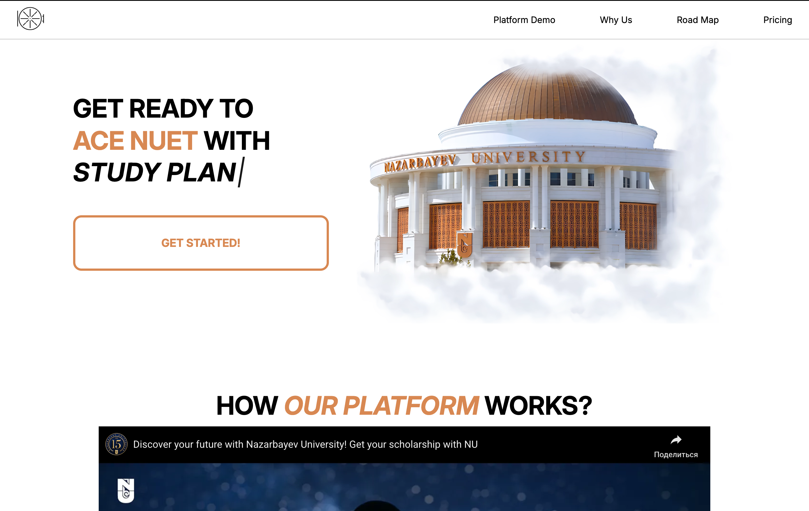

# NUET Vault — Landing Page (Vite + React)

Лендинг проекта **NUET Vault** — Маркетинговый лендинг **NUET Vault** в социальных сетях. Цель сайта — кратко презентовать продукт, показать преимущества и тарифы, ответить на частые вопросы и привести пользователя к целевому действию (заявка/регистрация/покупка). Страница состоит из секций (Hero/демо/почему мы/roadmap/цены/футер) и включает анимированный текст и таймлайн “Roadmap to NU”. 

---

## Фотки


---

## Технологии

- **React** + **Vite**   
- **CSS Modules** (модульные стили компонентов)   
- **react-vertical-timeline-component** для таймлайна   
- Подготовлены зависимости для **роутинга** и **локализации** (react-router-dom, i18next). :contentReference[oaicite:9]{index=9}  

---

## Быстрый старт

```bash
npm install

npm run dev
